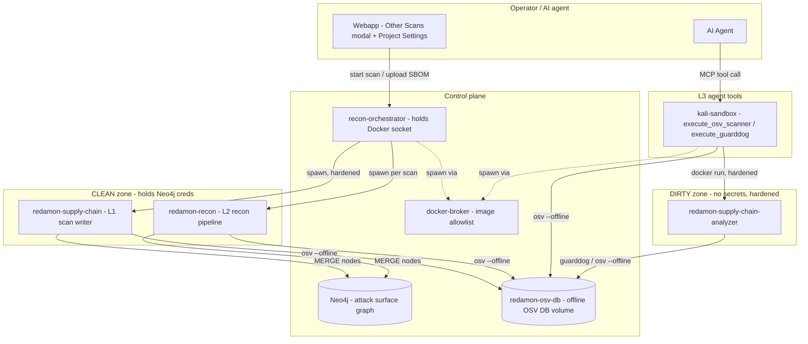
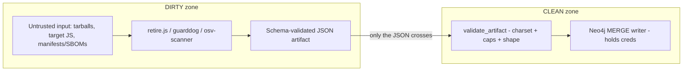
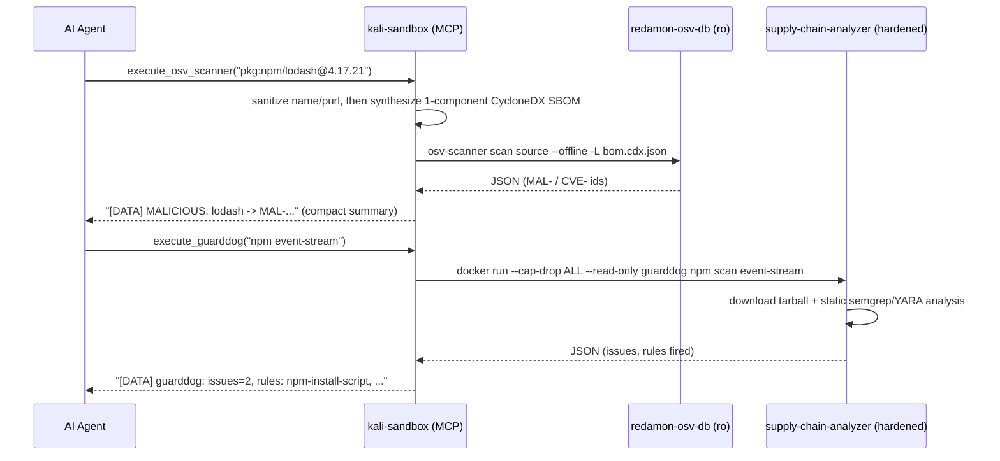
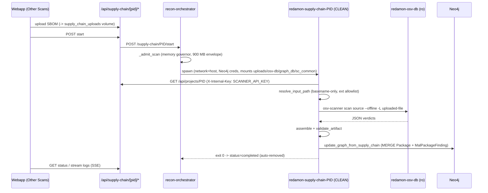
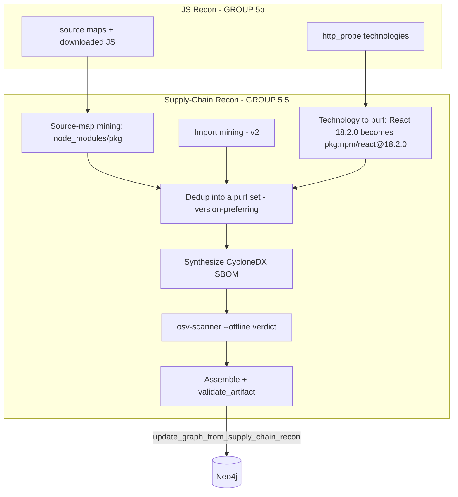
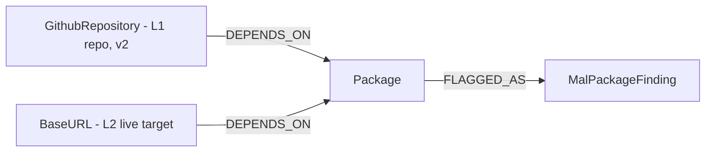
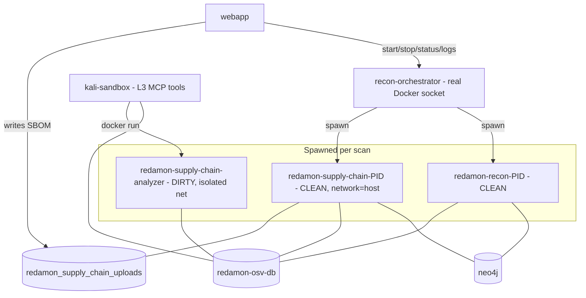

# Supply-Chain / Malicious-Package Detection

RedAmon detects **known-malicious** (`MAL-`) and **known-vulnerable** (`CVE`/`GHSA`)
software packages in a target's dependency surface, **fully offline** against a
local copy of the [OSV](https://osv.dev) database. It ships as three layers that
share one engine and one graph model, so a repository scan, a live-target harvest,
and an agent lookup all dedup into the same nodes.

This document is the technical reference: how each layer is implemented, how the
tools work, which Neo4j nodes are generated (and whether they are created or
enriched), the container topology, and how the feature integrates with the rest
of RedAmon.

- [The three layers at a glance](#the-three-layers-at-a-glance)
- [System architecture](#system-architecture)
- [The offline OSV database](#the-offline-osv-database)
- [The shared engine (`supply_chain_common`)](#the-shared-engine-supply_chain_common)
- [Security posture: the DIRTY / CLEAN split](#security-posture-the-dirty--clean-split)
- [Layer L3 - Agent tools](#layer-l3--agent-tools)
- [Layer L1 - Standalone scan (Other Scans)](#layer-l1--standalone-scan-other-scans)
- [Layer L2 - Recon pipeline module](#layer-l2--recon-pipeline-module)
- [Graph model](#graph-model)
- [Container topology](#container-topology)
- [Integration with RedAmon components](#integration-with-redamon-components)
- [v1 scope and v2 roadmap](#v1-scope-and-v2-roadmap)
- [Key files](#key-files)

---

## The three layers at a glance

| Layer | Name | What it is | Where it runs | Writes graph nodes? |
|---|---|---|---|---|
| **L3** | Agent tools | On-demand MCP tools the AI agent calls mid-engagement | `kali-sandbox` (+ dispatch to the analyzer) | No - returns text to the agent |
| **L1** | Supply-Chain Scan | Standalone audit of an uploaded SBOM / lockfile | `redamon-supply-chain-PID` (spawned) | Yes - `Package`, `MalPackageFinding` |
| **L2** | Supply-Chain Recon | Black-box harvest of a live target's served packages | `redamon-recon-PID` (recon GROUP 5.5) | Yes - `Package`, `MalPackageFinding` |

**Tools (pinned):**

| Tool | Role | Version | Runtime |
|---|---|---|---|
| **OSV-Scanner** | Verdict engine - is a package `MAL-` (malicious) or `CVE`/`GHSA` (vulnerable)? | v2.4.0 | Go static binary |
| **GuardDog** | Behavioural analysis - does the package *behave* like malware (install hooks, obfuscation, exfil, typosquat)? | v3.0.1 | Python (+ semgrep, YARA) |
| **retire.js** | Black-box JS library + version harvest (L2, v2) | v5.4.3 | Node CLI |

A vulnerability id starting with `MAL-` is a **terminal malicious verdict** (the
package itself is malware, e.g. a typosquat). `CVE-` / `GHSA-` ids are ordinary
known-vulnerable findings and are **never** written as malicious. A GuardDog hit
is always `suspicious`, never `malicious` - only an OSV `MAL-` hit is malicious.

---

## System architecture

The whole feature is built around one idea: **separate the code that touches
untrusted bytes from the code that holds secrets.** Package tarballs, target-served
JS, and OSV/registry metadata are all attacker-influenceable; the Neo4j password,
the internal API key, and the GitHub token are not. So every operation is split
between a hardened **DIRTY** zone (no secrets, processes hostile bytes) and a
**CLEAN** zone (holds creds, writes the graph, only ever sees a validated JSON
artifact).



The **shared engine** (`supply_chain_common/`) is a pure-Python package of runners
and parsers mounted read-only into every CLEAN/DIRTY container the same way
`graph_db` is mounted. The **offline OSV database** is a named Docker volume
mounted read-only everywhere except the one-time sync step.

---

## The offline OSV database

The verdict path makes **zero network calls**. A shared Docker volume
`redamon-osv-db` holds the OSV database, populated lazily per-ecosystem:

```bash
./redamon.sh supply-chain-sync npm           # ~208 MB, first run only
./redamon.sh supply-chain-sync npm PyPI Go    # add more ecosystems
```

**How the sync works** (`supply_chain_common/osv_db_sync.py`):

1. For each requested ecosystem, a minimal **seed manifest** is written to a temp
   dir (a one-line `package-lock.json`, `requirements.txt`, `go.mod`, etc.).
2. `osv-scanner scan source --offline --download-offline-databases -L <seed>`
   runs; osv-scanner recognizes the ecosystem from the seed and downloads *its*
   database into the cache directory. Using the tool's own download step keeps us
   independent of its internal on-disk layout.
3. Freshness markers (`.redamon_synced_<eco>`) bound refresh to once per 24h.
4. The DB tree is made world-readable/traversable, because osv-scanner writes it
   `0750` as root but the scan containers run **non-root + read-only** and would
   otherwise silently see an empty DB.

**How offline scanning works** (`supply_chain_common/osv_runner.py`):

- The flag is `--offline` (verified against v2.4.0). `--offline-vulnerabilities`
  does **not** load the local DB in this build and returns empty results - do not
  use it.
- The DB path is passed via the env var `OSV_SCANNER_LOCAL_DB_CACHE_DIRECTORY`.
- osv-scanner picks its extractor from the **file basename** (`package-lock.json`,
  `bom.cdx.json`), so scanned files must be named with a recognized name.
- If the DB dir is missing or empty (created by `update`/`up` but not yet synced),
  the runner returns a hard, actionable error instead of a silent false-clean.

The DB is **not** downloaded at install time (the container images are eager, the
data is lazy). `redamon.sh purge` removes the volume; `clean` keeps it.

### Automatic refresh (lazy-on-scan)

OSV publishes new `MAL-`/`CVE` advisories daily, so a DB frozen at install time
silently misses new malware. The orchestrator therefore **refreshes the DB on the
scan-spawn path**, TTL-guarded:

| Trigger | Refreshes? |
|---|---|
| Full recon (`start_recon`) | Yes - the L2 module runs in GROUP 5.5 |
| Partial recon | Only for `tool_id == SupplyChainRecon` |
| L1 Supply-Chain scan (`start_supply_chain`) | Yes |
| L3 agent tools | No - `kali-sandbox` is deliberately off the orchestrator network; it rides the L1/L2 refreshes |

Semantics: if the DB was synced **< TTL** ago (default 24h) the check is a **~1s
no-op**; if it is older, the feed re-downloads before the scan starts. It is
**best-effort** - a refresh failure (offline host, GCS unreachable) is logged and
the scan proceeds against the existing DB, never blocked.

**Why the orchestrator does it:** `redamon-osv-db` is mounted **read-only** into
every scan container, which also runs non-root, so a scanner physically cannot
refresh its own DB. Only the orchestrator holds the Docker socket, so it runs a
short-lived root sidecar (off the analyzer image) that writes the volume rw, then
re-applies the world-readable perms the non-root scanners need.

| Knob (orchestrator env) | Default | Meaning |
|---|---|---|
| `OSV_DB_AUTO_REFRESH` | `true` | Set `false` for a strictly air-gapped deploy (manual `supply-chain-sync` only) |
| `OSV_DB_ECOSYSTEMS` | `npm` | Ecosystems kept fresh automatically |
| `OSV_DB_TTL_SECONDS` | `86400` | Freshness window (24h) |
| `OSV_DB_REFRESH_TIMEOUT` | `900` | Hard ceiling so a slow download cannot stall a scan spawn |

All four are wired explicitly in `docker-compose.yml` (the orchestrator has **no
`env_file`**, so an unwired var would be silently inert) and need no `.env` edit.

---

## The shared engine (`supply_chain_common`)

A top-level Python package, mounted read-only into the recon / scan / analyzer
containers like `graph_db`. It holds only pure runners and defensive parsers - no
secrets, no graph writes.

| Module | Responsibility |
|---|---|
| `osv_runner.py` | `run_osv_scan(target, mode, db_path)` shells out to osv-scanner offline; `parse_osv_json` splits `MAL-` from `CVE-/GHSA-`. |
| `guarddog_runner.py` | `scan_package` / `verify_lockfile`; `parse_guarddog` normalizes the scan-object and verify-list shapes, applies the severity map. |
| `retire_runner.py` | `scan_js_dir` over downloaded JS; `parse_retire_json`; `to_purls`. (Wired in v2.) |
| `purl.py` | Canonical package-URL construction (`pkg:npm/lodash@4.17.21`), npm-scope `%40` encoding, Maven `group:artifact` -> namespace/name, PyPI PEP 503 normalization. |
| `security.py` | `sanitize_name` / `sanitize_purl` / `sanitize_version` (strict charset gate before any subprocess/filename), and `validate_artifact` (the DIRTY->CLEAN boundary). |
| `artifact.py` | Shared artifact assembly (`empty_artifact`, `add_osv_findings`, `add_guarddog_findings`, `to_cyclonedx`, `osv_mode_for_path`). |
| `osv_db_sync.py` | Lazy per-ecosystem OSV DB population. |
| `_run.py` | `run_argv` - `shell=False` subprocess with timeout + ANSI strip; never raises on a "findings present" non-zero exit. |

Every function that reaches a subprocess or a filename first passes untrusted
names through `sanitize_name` (charset allowlist, rejects `..`, shell metacharacters,
leading `-`/`/`, control chars). All shell-outs are `shell=False` with a list argv.

**The artifact** is the single JSON document that crosses the DIRTY->CLEAN
boundary:

```json
{
  "schema_version": 1,
  "mode": "lockfile | sbom | dir | js-dir | purls",
  "packages":   [{"purl","name","version","ecosystem","source","source_path"}],
  "malicious":  [{"purl","name","version","ecosystem","advisory_id","severity","confidence","title","aliases"}],
  "vulnerable": [{"purl","name","version","ecosystem","advisory_id","severity","confidence","title"}],
  "suspicious": [{"name","version","ecosystem","rule","severity","confidence","message","soft_error"}],
  "errors":     ["..."]
}
```

`validate_artifact` rejects unknown fields, caps array sizes (truncating with a
recorded error rather than dropping a verdict), caps string lengths, and
charset-validates every `purl` / `version` / `ecosystem` / `advisory_id` - so a
compromised analyzer cannot smuggle a path-traversal or shell payload into the
trusted zone.

---

## Security posture: the DIRTY / CLEAN split



| Control | Where |
|---|---|
| **DIRTY sandbox** `cap_drop=ALL`, `read_only` rootfs + tmpfs, non-root, mem/pids/cpu caps, **no secrets** | `run_supply_chain_analyzer` (modeled on `codefix_sandbox`) |
| **Network isolation** - OSV path zero-egress; GuardDog registry-egress opt-in, fails closed | dedicated `redamon-supply-chain-net` bridge |
| **NO-INSTALL invariant** - never run `npm/pip/... install` on a target manifest (lifecycle scripts = RCE); static parse only | CI grep test over supply-chain source |
| **Name sanitization** (S6/S7) - charset allowlist before any subprocess/filename | `sanitize_name` |
| **DIRTY->CLEAN boundary** (S5) - schema-validate the artifact | `validate_artifact` |
| **SSRF guard** (S4) - L2 makes no new fetches; it parses data JS-recon already downloaded | `harvest.py` (no `requests.get`) |
| **Tenant isolation** (S10) - every MERGE key includes `user_id` + `project_id` | `supply_chain_mixin.py` |
| **Broker allowlist** - `redamon-supply-chain-analyzer` + `redamon-supply-chain` images + `redamon-osv-db` volume | `docker_broker/broker.py` |

The `redamon-supply-chain-analyzer` and `redamon-supply-chain` images and the
`redamon-osv-db` volume are on the docker-broker allowlist; a non-allowlisted
image is denied.

---

## Layer L3 - Agent tools

Two MCP tools the AI agent calls mid-engagement, exposed on the existing
`network_recon` MCP server inside `kali-sandbox`. **L3 writes no graph nodes** -
it returns compact text summaries the agent reasons over (framed as data, never
instructions).



- **`execute_osv_scanner`** - passive, fully offline. Accepts a purl (synthesized
  into a one-component CycloneDX SBOM), a workspace lockfile path, or an SBOM
  path. Reads `redamon-osv-db`, zero egress. `MAL-` = terminal malicious verdict;
  `CVE-`/`GHSA-` = known-vulnerable.
- **`execute_guarddog`** - DANGEROUS (downloads an attacker-authored tarball). It
  does **not** unpack inline in kali (kali is `seccomp:unconfined` + `NET_RAW`);
  it dispatches to the hardened analyzer image via `docker run` with
  `cap_drop=ALL`, `read_only`, resource caps. A hit is `suspicious`, never a
  terminal verdict.

Registered in `agentic/prompts/tool_registry.py`; phase-gated in
`agentic/project_settings.py` (`execute_osv_scanner` -> all phases;
`execute_guarddog` -> informational + exploitation, and in `DANGEROUS_TOOLS`).
The `network_recon_server.py` parsing is inline (kali is a separate image that
does not import `supply_chain_common`).

**Node generation:** none. L3 is a read-only intelligence lookup for the agent.

---

## Layer L1 - Standalone scan (Other Scans)

The operator uploads an SBOM / lockfile and starts a scan from the **Other Scans**
modal. The orchestrator spawns a CLEAN writer container that runs a static,
offline osv-scanner pass and MERGEs the results into the graph.



**Implementation:**

- **Lifecycle** (`recon_orchestrator/container_manager.py::start_supply_chain`,
  modeled on `start_trufflehog`): memory admission, spawn, `get/pause/resume/stop`,
  SSE log streaming (offloaded to the log-stream executor), auto-remove on finish,
  and registration in `_active_scan_keys` so the governor accounts for it. REST
  endpoints live at `recon_orchestrator/api.py` (`/supply-chain/PID/*`); the
  webapp proxies them at `webapp/src/app/api/supply-chain/[projectId]/*`.
- **The CLEAN writer** (`supply_chain_scan/`): fetches settings from the webapp
  API using the scoped `SCANNER_API_KEY`, validates the uploaded filename
  (basename-only, extension allowlist, no traversal), runs osv-scanner offline via
  `supply_chain_common`, assembles + validates the artifact, and writes the graph
  with `Neo4jClient` (it holds the Neo4j creds; the DIRTY analyzer does not).
- **Input safety:** the uploaded file lands in the `redamon_supply_chain_uploads`
  named volume under a per-project subdir; the scan mounts it **read-only**, so
  project A cannot read project B's SBOM.

**Nodes generated by L1:**

| Node | Create or enrich? | How |
|---|---|---|
| `Package` | **Create or enrich** | MERGE on `(purl, user_id, project_id)`. A first sighting is created; a package already present from another scan/layer is enriched (`last_seen` + props updated). |
| `MalPackageFinding` | **Create or enrich** | MERGE on `(finding_id, user_id, project_id)`. The verdict is created or its props refreshed. |
| `(Package)-[:FLAGGED_AS]->(MalPackageFinding)` | Create | Links each verdict to its package. |

L1 v1 input is an **uploaded SBOM / lockfile**, which has no repository/URL parent
in the graph, so its `Package` nodes **float** (no `DEPENDS_ON` edge). GitHub-repo
input (which would anchor to a `GithubRepository` node) is v2. L1 does **not**
mutate any pre-existing non-supply-chain node.

---

## Layer L2 - Recon pipeline module

During recon, against the **live target with no manifest**, L2 harvests the npm
package set the target actually serves, verdicts it offline, and MERGEs the same
node types - anchored to the target's `BaseURL` nodes. It runs as **GROUP 5.5** of
the pipeline, immediately after JS Recon (whose output it consumes), and is also
runnable standalone as a **partial recon** tool.



**The harvest chain** (`recon/helpers/supply_chain/harvest.py`) is **pure parsing
of data JS-recon already downloaded - it makes no new network request**, which
satisfies the SSRF control (S4) by construction:

1. **Source-map mining** - extract `node_modules/(@scope/)?<pkg>` from the
   `sources[]` of source maps JS-recon already fetched. Exact npm names, no
   versions (nested `node_modules` and scoped packages handled).
2. **Import mining** (v2) - bare specifiers from JS `import`/`require`.
3. **Technology -> purl** - map `http_probe` technologies (the real
   `"Name:Version"` strings, e.g. `React:18.2.0`) to npm purls with versions.

Names without a version (source-map/import mining) are recorded as `Package`
nodes for inventory but **cannot be OSV-verdicted** (osv-scanner needs a version
to match a version-specific advisory); verdicts come primarily from the
version-bearing sources (technologies now, retire.js in v2). The harvest is
deduped into a purl set (a versioned sighting wins over a versionless one),
synthesized into a CycloneDX SBOM, and scanned offline. The result is stored on
`combined_result['supply_chain_recon']` and written by
`_graph_update_bg("update_graph_from_supply_chain_recon", ...)`.

**Pipeline placement** (`recon/main.py`): GROUP 5.5, gated on
`SUPPLY_CHAIN_RECON_ENABLED`, after `run_js_recon` so its `source_maps` +
`technologies` are available. Settings live in `recon/project_settings.py`
(`SUPPLY_CHAIN_RECON_ENABLED`, `_ECOSYSTEMS`, `_DEEP_ANALYSIS_ENABLED`).

**Partial recon** (`recon/partial_recon_modules/supply_chain.py`, tool id
`SupplyChainRecon`): reuses the full JS-recon flow to fetch the served JS, then
runs the harvest + verdict + graph write standalone. Inputs are `BaseURL` /
`Endpoint` URLs from the graph plus user-provided URLs.

**Nodes generated by L2:**

| Node / edge | Create or enrich? | How |
|---|---|---|
| `Package` | **Create or enrich** | MERGE on `(purl, user_id, project_id)`; `source` = `sourcemap` / `wappalyzer` / `import` / `osv`. Dedups with L1's packages of the same purl. |
| `MalPackageFinding` | **Create or enrich** | MERGE on `(finding_id, user_id, project_id)`. |
| `(BaseURL)-[:DEPENDS_ON]->(Package)` | Create - **enriches the existing `BaseURL`** | Anchored to each served base URL, normalized to `scheme://netloc`. The edge is created **only when the `BaseURL` node already exists** (recon created it earlier); L2 never invents target nodes. |
| `(Package)-[:FLAGGED_AS]->(MalPackageFinding)` | Create | Links verdict to package. |

So L2 **enriches** the existing attack-surface graph: it adds `DEPENDS_ON` edges
from the recon-discovered `BaseURL` nodes to the new `Package` nodes, without
mutating the `BaseURL` nodes themselves.

---

## Graph model

Two node types, shared by L1 + L2 (so a repo/SBOM scan and a live scan of the same
project dedup into the same nodes). Constraints in `graph_db/schema.py`; writer in
`graph_db/mixins/supply_chain_mixin.py`.



**`Package`** - a discovered dependency.

| Property | Notes |
|---|---|
| `purl` | canonical package URL, e.g. `pkg:npm/lodash@4.17.21` (part of the MERGE key) |
| `ecosystem` | `npm`, `PyPI`, `Go`, `Maven`, `crates.io`, `Packagist`, `RubyGems`, `NuGet` |
| `name`, `version` | `version` nullable (L2 black-box may not know it) |
| `source` | `sbom` / `lockfile` / `sourcemap` / `retirejs` / `import` / `wappalyzer` / `osv` / `finding` |
| `user_id`, `project_id` | tenant scope |
| `first_seen`, `last_seen` | `ON CREATE SET first_seen`; `SET last_seen` unconditional |

Merge key: `(purl, user_id, project_id)`.

**`MalPackageFinding`** - a verdict about a package.

| Property | Notes |
|---|---|
| `finding_id` | `sha256(purl + ':' + advisory_or_rule)[:16]` (part of the MERGE key) |
| `verdict` | `malicious` (OSV `MAL-`) or `suspicious` (GuardDog) |
| `source_tool` | `osv` or `guarddog` |
| `advisory_id` | `MAL-...` / `CVE-...` / `GHSA-...` or a GuardDog rule name |
| `severity`, `confidence`, `title`, `detail` | display fields |
| `user_id`, `project_id` | tenant scope |
| `first_seen`, `last_seen` | as above |

Merge key: `(finding_id, user_id, project_id)`.

**Rules**

- All writes MERGE (`ON CREATE SET first_seen`, unconditional `SET last_seen`) -
  running twice yields the same node count (idempotent).
- The finding path **MERGEs the `Package`** (not MATCH), so a finding whose package
  was not in the harvested set (a GuardDog name-only hit) still attaches - there is
  never an orphaned `MalPackageFinding`.
- Only OSV `MAL-` ids become `verdict=malicious`. `CVE-`/`GHSA-` stay in the raw
  JSON output and are **not** written as findings.
- Every MERGE key is tenant-scoped; the `querySupplyChain` report path filters
  `{project_id}` and goes through the project-access guard.

**Create vs enrich, summarized:** `Package` and `MalPackageFinding` are always
**create-or-enrich** (MERGE), which is how the three layers converge. The only
existing nodes L2/L1 touch are `BaseURL` (L2) and, in v2, `GithubRepository` (L1),
which they **enrich with a `DEPENDS_ON` edge** but never mutate.

---

## Container topology



| Container | Zone | Lifecycle | Holds Neo4j creds? | OSV DB | Network |
|---|---|---|---|---|---|
| `redamon-supply-chain-PID` (L1) | CLEAN | spawned per scan, auto-removed | Yes | ro | host (reach Neo4j at `localhost:7687`) |
| `redamon-recon-PID` (L2) | CLEAN | spawned per recon scan | Yes | ro (mounted at spawn) | host |
| `redamon-supply-chain-analyzer` | DIRTY | `docker run` per L3 GuardDog call | **No** | ro | isolated bridge (`redamon-supply-chain-net`); GuardDog egress opt-in |
| `kali-sandbox` (L3) | tool | long-lived | no (uses scoped tokens) | ro | internal |

Build-time: the two supply-chain images build under `--profile tools`
(`redamon-supply-chain`, `redamon-supply-chain-analyzer`); `osv-scanner` is baked
into `recon` and `kali-sandbox`; `supply_chain_common` is **mounted** (hot-reload,
no rebuild) into recon / scan / analyzer at spawn.

---

## Integration with RedAmon components

| RedAmon component | How supply-chain integrates |
|---|---|
| **recon-orchestrator** | Owns the L1 + L2 + analyzer lifecycle via the Docker SDK; `_active_scan_keys` + `_admit_scan` account for the 900 MB envelope; `cleanup()` and `refresh_all_scan_states()` sweep supply-chain so containers and reservations never leak. |
| **Memory governor** | `scan_job_envelope_bytes["supply_chain"] = 900 MB` in both the fallback profile and the shipped `resource_profile.default.json`; `_container_mem_limit("supply_chain")` resolves the cap. |
| **docker-broker** | The two images + the `redamon-osv-db` volume are allowlisted; a look-alike image is denied. |
| **Neo4j / graph_db** | `SupplyChainMixin` is added to `Neo4jClient`; two `CREATE CONSTRAINT`s in `graph_db/schema.py`. The agent's `query_graph` sees `Package` / `MalPackageFinding` like any other node. |
| **Webapp** | Prisma fields (`supplyChain*`, `supplyChainRecon*`); `/api/supply-chain/[projectId]/*` proxy routes + SBOM upload; `useSupplyChainStatus` / `useSupplyChainSSE` hooks; a Supply Chain card in the Other Scans modal (with a logs drawer) and a Supply Chain settings section. |
| **Settings (5 layers)** | Prisma default -> `recon/project_settings.py` (L2) / `supply_chain_scan/project_settings.py` (L1) -> `/defaults` -> webapp section, using the `x_enabled` / `xEnabled` / `X_ENABLED` naming. |
| **redamon.sh** | `supply-chain-sync` populates the DB; `TOOL_IMAGES` + `cmd_update` build/rebuild the two images; `cmd_install`/`up` build them via `--profile tools`. |
| **SCANNER_API_KEY (S3/E6)** | The L1 scan container fetches settings with the scoped `SCANNER_API_KEY` (falling back to `INTERNAL_API_KEY` on pre-secret installs); the analyzer holds no key at all. |

---

## v1 scope and v2 roadmap

**v1 (shipped):**

- L1 input: an uploaded **SBOM / lockfile** (static, offline). Nodes float (no repo anchor).
- L2: source-map + technology harvest + offline OSV verdict; anchored to `BaseURL`.
- L3: `execute_osv_scanner` (offline) + `execute_guarddog` (dispatched to the analyzer).

**Deferred to v2:**

- L1 **GitHub-repo** input (clone in the DIRTY analyzer, anchor to `GithubRepository`).
- L2 **retire.js** harvest of served JS (versioned components -> more verdicts).
- **GuardDog deep-analysis** dispatch in L1/L2 (off by default; flagged-package-only).
- Non-`MAL` OSV ids (`CVE`/`GHSA`) routed to the existing CVE node path.

---

## Key files

```
supply_chain_common/        # shared engine: runners, parsers, security, artifact, db sync
supply_chain_analyzer/      # DIRTY image + entrypoint (sc-analyze)
supply_chain_scan/          # L1 CLEAN writer (main, runner, project_settings, Dockerfile)
recon/helpers/supply_chain/harvest.py            # L2 black-box harvest (pure, no network)
recon/main_recon_modules/supply_chain_recon.py   # L2 pipeline module (GROUP 5.5)
recon/partial_recon_modules/supply_chain.py      # L2 partial recon
graph_db/mixins/supply_chain_mixin.py            # Package + MalPackageFinding writer
graph_db/schema.py                               # uniqueness constraints
mcp/servers/network_recon_server.py              # L3 execute_osv_scanner / execute_guarddog
recon_orchestrator/{container_manager,api,models}.py  # L1 lifecycle + REST
webapp/src/app/api/supply-chain/                 # proxy routes + SBOM upload
webapp/src/components/projects/ProjectForm/sections/SupplyChainSection.tsx
readmes/GRAPH.SCHEMA.md                           # node documentation
```
